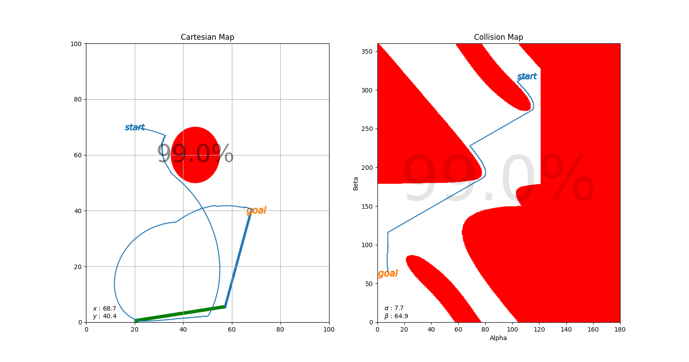
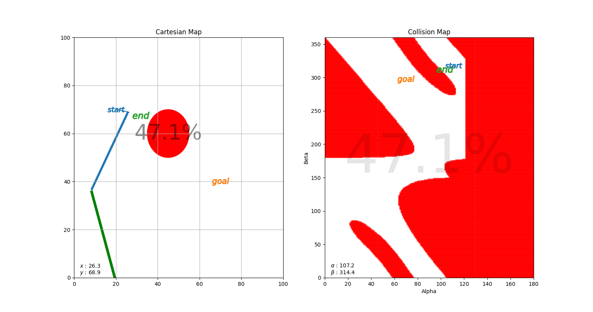

# Robot Motion Planning
TL;DR: Implementation of the potential field approach for a 2-linked planar robot.

If you want to dive in check this [Colab Notebook](https://colab.research.google.com/drive/1bQN3pF2ijRC-mpllqRBaNvI67GU2RvTo?usp=sharing).
---

----
Determining where to go without hitting obstacles is one of the key problems in the area of robotics. There has been couple of approaches to solve the problem of motion planning. Cell decompositions, voronoi diagrams and potential fields can be given as examples to these approaches. 

## What is in this repo?
In this repository you will find the implementation (both Python and Matlab) of the potential field approach for a 2R planar robot. The task is simple:

* All parts of the robot should be within the boundaries of the workspace (100 by 100 units) at all times
* The robot should avoid any collision with the obstacle
* The end effector of the robot should reach the given goal

Implementation calculates the trajectory for the given configuration. After the calculations, the robot is animated in a new window.
You can tweak the parameters to observe how the trajectory of the robot changes.

There also is a Jupyter Notebook file. Same implementation with detailed explanations and interactive plots can be found in that. 

Enjoy!

